# Diagramme de Classes - E-Santé 4.0 (MVP - 1 mois)

## Vue d'ensemble
Architecture simplifiée pour le MVP réalisable en 1 mois. Focus sur les classes essentielles pour l'évaluation du risque d'asthme.

## Architecture en couches

```
┌─────────────────────────────────────────────────────────┐
│                    PRESENTATION LAYER                    │
│           (UI Screens + BLoC + Widgets)                  │
└─────────────────────────────────────────────────────────┘
                          ↓
┌─────────────────────────────────────────────────────────┐
│                     DOMAIN LAYER                         │
│        (Entities + Use Cases + Repositories)             │
└─────────────────────────────────────────────────────────┘
                          ↓
┌─────────────────────────────────────────────────────────┐
│                      DATA LAYER                          │
│          (Models + SQLite + API Client)                  │
└─────────────────────────────────────────────────────────┘
```

## Diagramme MVP simplifié

```mermaid
classDiagram
    %% ========================================
    %% DOMAIN LAYER - ENTITIES (CORE)
    %% ========================================
    
    class User {
        -String id
        -String name
        -String email
        -String password
        -DateTime createdAt
        +bool isValid()
    }

    class Assessment {
        -String id
        -String userId
        -int age
        -String gender
        -double weight
        -double height
        -bool familyAsthma
        -bool hasAllergies
        -int smokingExposure
        -int pollutionLevel
        -int coughLevel
        -int breathlessnessLevel
        -int wheezingLevel
        -DateTime createdAt
        +double calculateBMI()
        +bool isComplete()
        +Map toJson()
    }

    class PredictionResult {
        -String id
        -String assessmentId
        -int riskLevel
        -String riskLabel
        -List~String~ recommendations
        -DateTime timestamp
        +String getRiskColor()
        +String getRiskEmoji()
    }

    %% ========================================
    %% DOMAIN LAYER - USE CASES
    %% ========================================

    class LoginUseCase {
        -AuthRepository repository
        +Future~User~ execute(String email, String password)
    }

    class RegisterUseCase {
        -AuthRepository repository
        +Future~User~ execute(String name, String email, String password)
    }

    class CreateAssessmentUseCase {
        -AssessmentRepository repository
        +Future~Assessment~ execute(String userId)
    }

    class SaveAssessmentUseCase {
        -AssessmentRepository repository
        +Future~void~ execute(Assessment assessment)
    }

    class GetAssessmentHistoryUseCase {
        -AssessmentRepository repository
        +Future~List~Assessment~~ execute(String userId)
    }

    class PredictRiskUseCase {
        -PredictionRepository repository
        +Future~PredictionResult~ execute(Assessment assessment)
    }

    %% ========================================
    %% DOMAIN LAYER - REPOSITORIES (INTERFACES)
    %% ========================================

    class AuthRepository {
        <<interface>>
        +Future~User~ login(String email, String password)
        +Future~User~ register(String name, String email, String password)
        +Future~User?~ getCurrentUser()
        +Future~void~ logout()
    }

    class AssessmentRepository {
        <<interface>>
        +Future~Assessment~ create(String userId)
        +Future~void~ save(Assessment assessment)
        +Future~List~Assessment~~ getHistory(String userId)
        +Future~Assessment?~ getById(String id)
    }

    class PredictionRepository {
        <<interface>>
        +Future~PredictionResult~ predict(Assessment assessment)
    }

    %% ========================================
    %% DATA LAYER - IMPLEMENTATIONS
    %% ========================================

    class AuthRepositoryImpl {
        -LocalDatabase database
        +Future~User~ login(String email, String password)
        +Future~User~ register(String name, String email, String password)
        +Future~User?~ getCurrentUser()
        +Future~void~ logout()
    }

    class AssessmentRepositoryImpl {
        -LocalDatabase database
        +Future~Assessment~ create(String userId)
        +Future~void~ save(Assessment assessment)
        +Future~List~Assessment~~ getHistory(String userId)
        +Future~Assessment?~ getById(String id)
    }

    class PredictionRepositoryImpl {
        -ApiClient apiClient
        +Future~PredictionResult~ predict(Assessment assessment)
    }

    class LocalDatabase {
        -Database db
        +Future~void~ insertUser(User user)
        +Future~User?~ getUserByEmail(String email)
        +Future~void~ insertAssessment(Assessment assessment)
        +Future~List~Assessment~~ getAssessments(String userId)
        +Future~void~ insertResult(PredictionResult result)
    }

    class ApiClient {
        -String baseUrl
        -http.Client client
        +Future~Map~ post(String endpoint, Map data)
        +Future~Map~ get(String endpoint)
    }

    %% ========================================
    %% PRESENTATION LAYER - BLOCS
    %% ========================================

    class AuthBloc {
        -LoginUseCase loginUseCase
        -RegisterUseCase registerUseCase
        +Stream~AuthState~ mapEventToState(AuthEvent event)
    }

    class AssessmentBloc {
        -CreateAssessmentUseCase createUseCase
        -SaveAssessmentUseCase saveUseCase
        -PredictRiskUseCase predictUseCase
        +Stream~AssessmentState~ mapEventToState(AssessmentEvent event)
    }

    class ProfileBloc {
        -GetAssessmentHistoryUseCase historyUseCase
        +Stream~ProfileState~ mapEventToState(ProfileEvent event)
    }

    %% ========================================
    %% RELATIONS
    %% ========================================

    %% Composition
    Assessment --> User : belongs to
    PredictionResult --> Assessment : results from

    %% Use Cases dependencies
    LoginUseCase --> AuthRepository
    RegisterUseCase --> AuthRepository
    CreateAssessmentUseCase --> AssessmentRepository
    SaveAssessmentUseCase --> AssessmentRepository
    GetAssessmentHistoryUseCase --> AssessmentRepository
    PredictRiskUseCase --> PredictionRepository

    %% Repository implementations
    AuthRepositoryImpl ..|> AuthRepository
    AssessmentRepositoryImpl ..|> AssessmentRepository
    PredictionRepositoryImpl ..|> PredictionRepository

    %% Data sources
    AuthRepositoryImpl --> LocalDatabase
    AssessmentRepositoryImpl --> LocalDatabase
    PredictionRepositoryImpl --> ApiClient

    %% BLoC dependencies
    AuthBloc --> LoginUseCase
    AuthBloc --> RegisterUseCase
    AssessmentBloc --> CreateAssessmentUseCase
    AssessmentBloc --> SaveAssessmentUseCase
    AssessmentBloc --> PredictRiskUseCase
    ProfileBloc --> GetAssessmentHistoryUseCase
```



## Description des classes principales

### 🎯 DOMAIN - Entities

#### User
Représente un utilisateur de l'application.
- **Attributs** : id, name, email, password, createdAt
- **Méthodes** : isValid() pour validation basique

#### Assessment
Contient toutes les données d'une évaluation.
- **Attributs** : Données démographiques, antécédents, environnement, symptômes
- **Méthodes** : calculateBMI(), isComplete(), toJson()

#### PredictionResult
Résultat de la prédiction ML.
- **Attributs** : riskLevel (0-3), riskLabel, recommendations
- **Méthodes** : getRiskColor(), getRiskEmoji() pour l'affichage

### 🔧 DOMAIN - Use Cases

6 use cases essentiels :
1. **LoginUseCase** : Connexion utilisateur
2. **RegisterUseCase** : Inscription utilisateur
3. **CreateAssessmentUseCase** : Créer nouvelle évaluation
4. **SaveAssessmentUseCase** : Sauvegarder évaluation
5. **GetAssessmentHistoryUseCase** : Récupérer historique
6. **PredictRiskUseCase** : Obtenir prédiction ML

### 💾 DATA - Repositories

#### LocalDatabase
Gestion SQLite locale.
- Stockage utilisateurs, évaluations, résultats
- Pas de synchronisation cloud (MVP)

#### ApiClient
Client HTTP simple pour l'API ML.
- Communication avec backend Flask (asthme-ia)
- Méthodes GET/POST basiques

### 🎨 PRESENTATION - BLoCs

3 BLoCs principaux :
1. **AuthBloc** : Gestion authentification
2. **AssessmentBloc** : Gestion évaluation
3. **ProfileBloc** : Gestion profil et historique

## Ce qui est EXCLU du MVP

❌ Classes complexes supprimées :
- `MedicalHistory` (simplifié dans Assessment)
- `EnvironmentData` (simplifié dans Assessment)
- `Symptoms` (simplifié dans Assessment)
- `HealthCenter` (feature retirée)
- `Article` (contenu éducatif retiré)
- `Medication` (rappels retirés)
- `Notification` (notifications retirées)
- Toutes les énumérations complexes
- Pattern Either/Failure (gestion erreur simplifiée)
- Modèles séparés Data/Domain (fusion pour simplicité)

❌ Fonctionnalités retirées :
- Authentification biométrique
- Synchronisation cloud
- Cache avancé
- Gestion offline complexe
- Export PDF
- Partage social
- Admin panel

## Stack technique MVP

**Frontend Flutter** :
- `flutter_bloc` : State management
- `sqflite` : Base de données locale
- `http` : Requêtes API
- `shared_preferences` : Stockage simple

**Backend** :
- API Flask existante (asthme-ia/main.py)
- Modèle Random Forest déjà entraîné

---

**Version MVP** : 1.0  
**Complexité** : ⭐⭐ (Simplifiée)  
**Durée** : 1 mois    class Failure {
        <<abstract>>
        -String message
    }

    class ServerFailure {
        -int statusCode
    }

    class CacheFailure {
    }

    class NetworkFailure {
    }

    class ValidationFailure {
        -Map~String, String~ errors
    }

    class Either~L, R~ {
        <<sealed>>
        +bool isLeft()
        +bool isRight()
        +L getLeft()
        +R getRight()
        +T fold~T~(T Function(L) leftFn, T Function(R) rightFn)
    }

    %% ========================================
    %% RELATIONS
    %% ========================================

    %% Domain - Entities Composition
    Assessment *-- ProfileData
    Assessment *-- MedicalHistory
    Assessment *-- EnvironmentData
    Assessment *-- Symptoms
    PredictionResult *-- RiskFactor
    ProfileData ..> InfectionFrequency
    MedicalHistory ..> InfectionFrequency
    EnvironmentData ..> SmokingExposure
    EnvironmentData ..> PollutionLevel
    EnvironmentData ..> Season
    Symptoms ..> SymptomSeverity
    HealthCenter ..> CenterType
    Notification ..> NotificationType
    Article ..> DifficultyLevel

    %% Domain - Use Cases Dependencies
    LoginUseCase --> AuthRepository
    RegisterUseCase --> AuthRepository
    PredictRiskUseCase --> PredictionRepository
    CreateAssessmentUseCase --> AssessmentRepository
    SaveAssessmentUseCase --> AssessmentRepository
    GetNearbyCentersUseCase --> HealthCenterRepository
    GetAssessmentHistoryUseCase --> AssessmentRepository

    %% Data - Repository Implementations
    AuthRepositoryImpl ..|> AuthRepository
    AssessmentRepositoryImpl ..|> AssessmentRepository
    PredictionRepositoryImpl ..|> PredictionRepository
    HealthCenterRepositoryImpl ..|> HealthCenterRepository

    %% Data - Repository -> Data Sources
    AuthRepositoryImpl --> AuthApi
    AuthRepositoryImpl --> SecureStorage
    AssessmentRepositoryImpl --> LocalStorage
    PredictionRepositoryImpl --> PredictionApi
    PredictionRepositoryImpl --> CacheManager
    HealthCenterRepositoryImpl --> HealthCenterApi
    HealthCenterRepositoryImpl --> CacheManager

    %% Data - API Dependencies
    AuthApi --> ApiClient
    PredictionApi --> ApiClient
    HealthCenterApi --> ApiClient
    EducationApi --> ApiClient

    %% Data - Storage
    CacheManager --> LocalStorage

    %% Data - Models to Entities
    UserModel ..> User : converts to
    AssessmentModel ..> Assessment : converts to
    PredictionResultModel ..> PredictionResult : converts to
    HealthCenterModel ..> HealthCenter : converts to

    %% Presentation - BLoC to Use Cases
    AuthBloc --> LoginUseCase
    AuthBloc --> RegisterUseCase
    AssessmentBloc --> CreateAssessmentUseCase
    AssessmentBloc --> SaveAssessmentUseCase
    AssessmentBloc --> PredictRiskUseCase
    PredictionBloc --> PredictRiskUseCase
    HealthCenterBloc --> GetNearbyCentersUseCase

    %% Presentation - Events/States
    AuthEvent <|-- LoginRequested
    AuthEvent <|-- RegisterRequested
    AuthEvent <|-- LogoutRequested
    AuthState <|-- AuthInitial
    AuthState <|-- AuthLoading
    AuthState <|-- Authenticated
    AuthState <|-- Unauthenticated
    AuthState <|-- AuthError
    
    AssessmentEvent <|-- AssessmentStarted
    AssessmentEvent <|-- ProfileDataUpdated
    AssessmentEvent <|-- MedicalHistoryUpdated
    AssessmentEvent <|-- AssessmentSubmitted
    AssessmentState <|-- AssessmentInitial
    AssessmentState <|-- AssessmentInProgress
    AssessmentState <|-- AssessmentCompleted
    AssessmentState <|-- AssessmentError

    %% Presentation - Screens to BLoC
    LoginScreen --> AuthBloc
    AssessmentScreen --> AssessmentBloc
    ResultScreen --> PredictionBloc
    HealthCenterMapScreen --> HealthCenterBloc

    %% Utility - Failures
    Failure <|-- ServerFailure
    Failure <|-- CacheFailure
    Failure <|-- NetworkFailure
    Failure <|-- ValidationFailure
```

## Explication des patterns utilisés

### 1. Clean Architecture (3 couches)
- **Domain Layer** : Entités métier pures + Use Cases + Interfaces repositories (pas de dépendances externes)
- **Data Layer** : Implémentation repositories + Models DTO + Data Sources (API, local storage)
- **Presentation Layer** : UI + BLoC state management + Widgets

### 2. Repository Pattern
- Abstraction de l'accès aux données
- Interfaces dans Domain, implémentations dans Data
- Permet de changer la source de données facilement

### 3. BLoC Pattern (Business Logic Component)
- Séparation logique métier et UI
- Communication via Events (input) et States (output)
- Gestion d'état prévisible et testable

### 4. Use Case Pattern
- Encapsulation de la logique métier
- Un use case = une action utilisateur
- Facilite les tests unitaires

### 5. DTO (Data Transfer Object)
- Models pour la communication API
- Conversion Models ↔ Entities
- Séparation données réseau et domaine métier

### 6. Either Type (Functional Programming)
- Gestion des erreurs explicite
- Either<Failure, Success>
- Pas d'exceptions non gérées

## Relations clés

### Composition forte (◆)
- `Assessment` **contient** `ProfileData`, `MedicalHistory`, `EnvironmentData`, `Symptoms`
- `PredictionResult` **contient** `RiskFactor`

### Agrégation (◇)
- `User` **possède** `Assessment` (historique)
- `User` **possède** `Medication` (liste)

### Dépendance (→)
- `UseCase` **dépend de** `Repository`
- `BLoC` **dépend de** `UseCase`
- `Screen` **dépend de** `BLoC`

### Implémentation (⋯▷)
- `RepositoryImpl` **implémente** `Repository interface`

### Héritage (△)
- `LoginRequested` **hérite de** `AuthEvent`
- `ServerFailure` **hérite de** `Failure`

## Principes SOLID appliqués

### Single Responsibility
- Chaque classe a une seule raison de changer
- Use Cases mono-responsables

### Open/Closed
- Repositories extensibles via interfaces
- Nouveaux Use Cases sans modifier existants

### Liskov Substitution
- Les implémentations respectent les contrats des interfaces

### Interface Segregation
- Interfaces granulaires (AuthRepository, AssessmentRepository, etc.)

### Dependency Inversion
- Domain ne dépend jamais de Data
- Dépendance vers les abstractions (interfaces)

## Points d'extension futurs

1. **Caching Strategy** : Ajout `CacheStrategy` (TimeToLive, LRU)
2. **Offline Sync** : `SyncManager` pour queue opérations offline
3. **Analytics** : `AnalyticsService` pour tracking événements
4. **Gamification** : `Badge`, `Achievement`, `Streak` entities
5. **Chat** : `Message`, `Conversation` entities
6. **Telemedicine** : `Appointment`, `VideoCall` entities

---

**Version** : 1.0  
**Date** : 23 décembre 2025  
**Architecture** : Clean Architecture + BLoC Pattern  
**Langage** : Dart/Flutter
