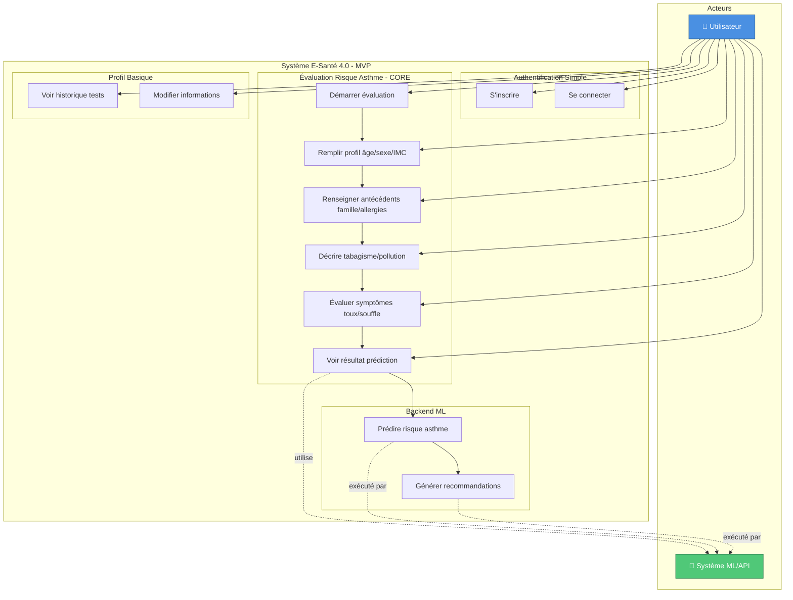

# Diagramme de Cas d'Utilisation - E-Santé 4.0 (MVP - 1 mois)

## Vue d'ensemble
Ce diagramme représente le MVP (Minimum Viable Product) réalisable en 1 mois. Focus sur les fonctionnalités essentielles et réalistes pour l'évaluation du risque d'asthme.

## Acteurs
- **Utilisateur** : Citoyen utilisant l'application pour évaluer son risque d'asthme
- **Système ML** : Backend de prédiction par Machine Learning (API Flask existante)

## Description des cas d'utilisation MVP

### 1. Module Authentification Simple (1 semaine)
- **UC1 - S'inscrire** : Email + mot de passe simple (Firebase Auth ou local SQLite)
- **UC2 - Se connecter** : Connexion basique avec validation

### 2. Module Évaluation Risque - CORE (2 semaines)
- **UC3 - Démarrer évaluation** : Créer une nouvelle évaluation
- **UC4 - Profil basique** : Âge, sexe, poids, taille (calcul IMC automatique)
- **UC5 - Antécédents** : Asthme familial (oui/non), allergies (oui/non)
- **UC6 - Environnement** : Exposition tabac (0-2), pollution (0-2)
- **UC7 - Symptômes** : Toux, essoufflement, sifflements (échelle 0-3)
- **UC8 - Résultat** : Affichage risque (0-3) + 3 recommandations simples

### 3. Module Profil Basique (3-4 jours)
- **UC9 - Historique** : Liste simple des tests passés (date + résultat)
- **UC10 - Modifier infos** : Mettre à jour nom, email, photo de profil

### 4. Backend ML (déjà développé)
- **UC11 - Prédiction** : Utilisation de l'API Flask existante (asthme-ia/main.py)
- **UC12 - Recommandations** : 3 conseils basés sur le niveau de risque

## Ce qui est EXCLU du MVP (non réaliste en 1 mois)
❌ Mode invité / Personnel médical / Administrateur  
❌ Réinitialisation mot de passe  
❌ Authentification biométrique  
❌ Suivi symptômes quotidiens  
❌ Rappels médicaments  
❌ Export PDF / Partage médecin  
❌ Articles éducatifs / Vidéos / Quiz  
❌ Centres de santé / Géolocalisation / Carte  
❌ Alertes qualité d'air / Harmattan  
❌ Notifications push  
❌ Multilinguisme (Baoulé, Dioula)  
❌ Mode sombre  
❌ Synchronisation cloud  
❌ Mode offline avancé  
❌ Gamification  
❌ Panel d'administration

## Règles métier MVP

1. **Données minimales** : 15 questions max pour l'évaluation
2. **Résultat simple** : Affichage niveau 0-3 (Faible/Modéré/Élevé/Très élevé)
3. **Stockage local** : SQLite pour démarrage rapide
4. **API ML** : Utilisation backend Flask existant
5. **UI basique** : Material Design simple sans animations complexes

## Planning réaliste 1 mois

### Semaine 1 : Setup + Auth
- Setup projet Flutter
- Authentification simple (inscription/connexion)
- Navigation de base

### Semaine 2 : Évaluation Core
- Formulaire multi-étapes (4 écrans)
- Validation données
- Calcul IMC

### Semaine 3 : Prédiction + Résultats
- Intégration API ML
- Écran résultats avec graphique simple
- Stockage local SQLite

### Semaine 4 : Profil + Tests
- Historique tests
- Écran profil utilisateur
- Tests et corrections bugs
- Documentation basique

---

**Version MVP** : 1.0  
**Durée** : 1 mois  
**Date** : 23 décembre 2025
